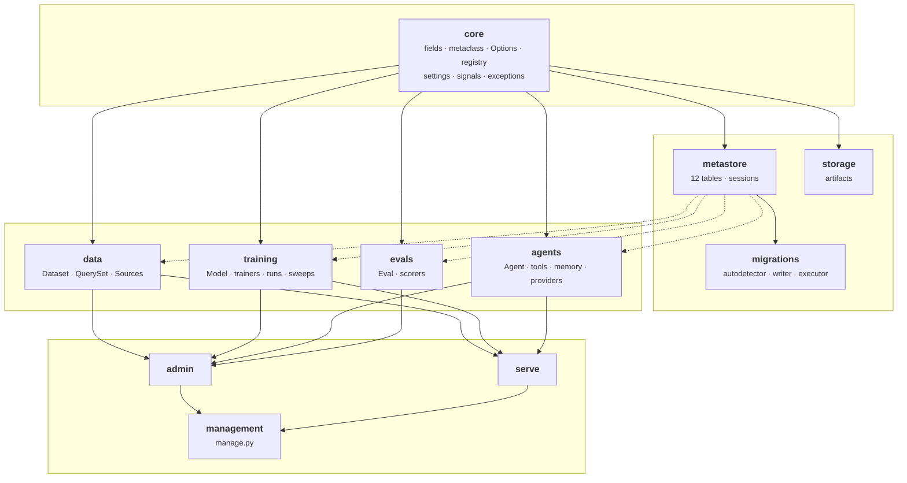
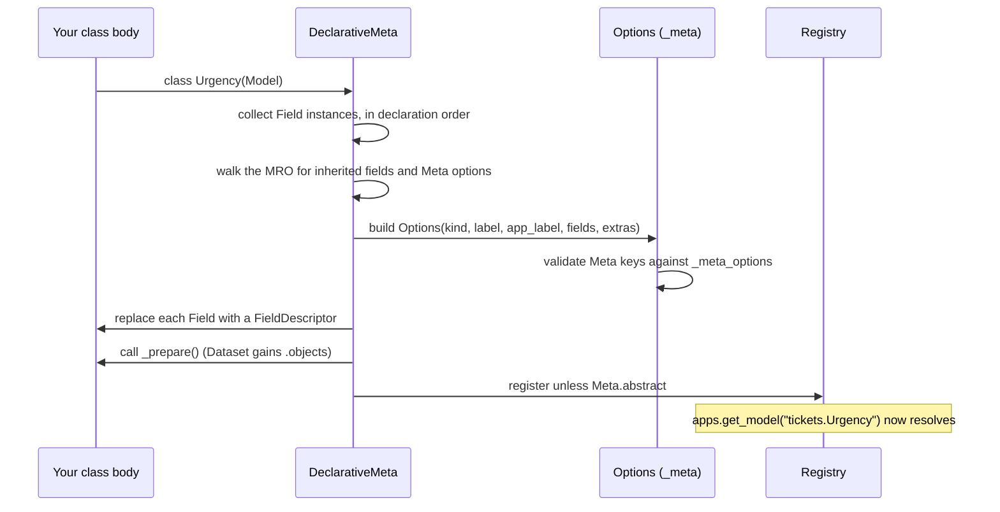
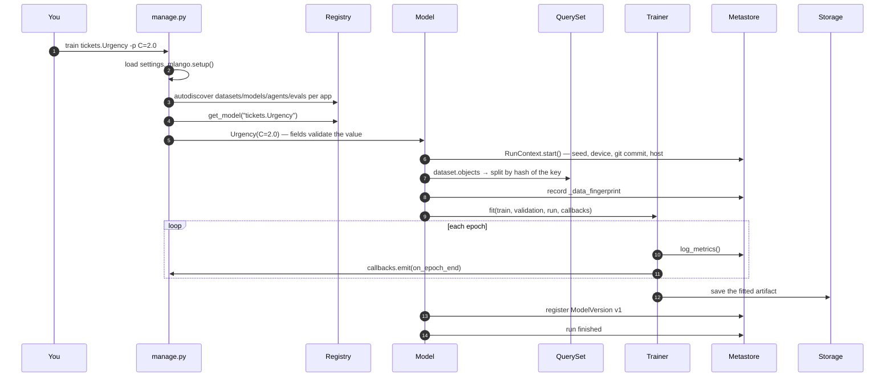
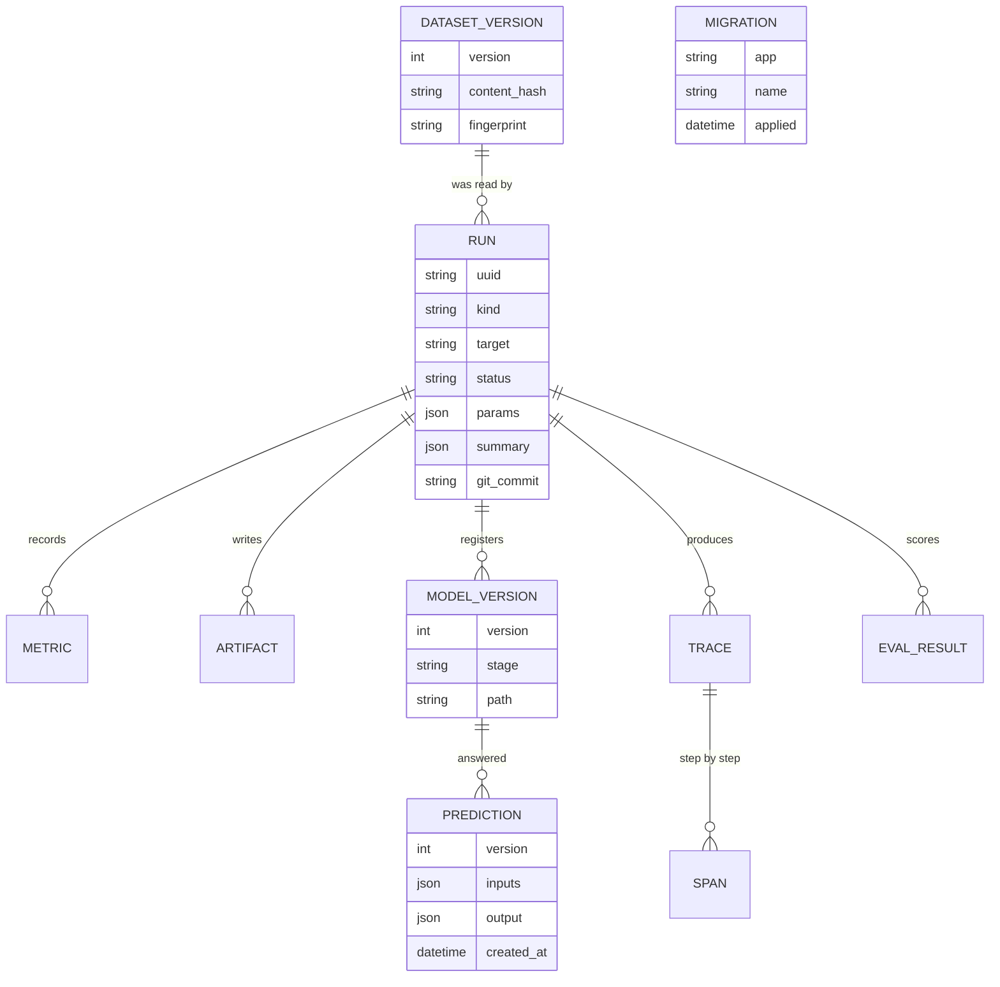
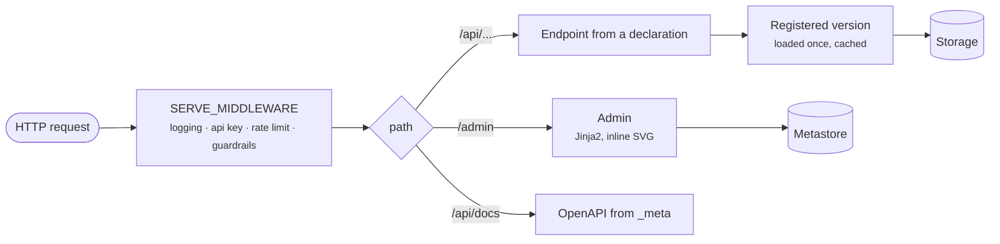

# Architecture

How the pieces fit, what may import what, and what actually happens when you run
a command. Every diagram here is text in the repository, so it can be reviewed
in a diff.

## The layers

The rules, which `tests/` and code review both enforce:

| Layer | May import | Must not import |
|---|---|---|
| `core` | the standard library | anything else in mlango |
| `metastore`, `storage` | `core` | the four families |
| `data`, `training`, `agents`, `evals` | `core`, `metastore`, `storage` | **each other** |
| `admin`, `serve`, `management` | everything, through `_meta` | — |

The one that matters most is the third. The four families not importing each
other is what lets you use the agent half without the ML half, and it is why a
project that declares only datasets never loads a line of agent code.

A helper needed by two families belongs in `core`. `core/serialization.py`
exists for exactly that reason: `agents` and `evals` were both reaching into a
private function in `training`.

## How a declaration becomes metadata

Two consequences worth knowing.

**Meta options inherit.** Python class bodies do not inherit on their own, so a
subclass writing its own `class Meta` would silently lose everything the parent
declared. `Options.inherit_extras()` fills in what the subclass did not name,
which is what makes a reusable base class like `TextClassifier` possible.
`abstract` is excluded, or every subclass of an abstract base would be abstract
too.

**An unknown `Meta` key is an error.** It lists the allowed ones, because a
silently ignored option is a bug you find weeks later.

## What `manage.py train` actually does

Everything after step 5 happens whether you asked for it or not. That is the
inversion: the parts that are easy to forget are the parts you do not write.

## The metastore

Eleven tables, SQLite by default and the same schema on Postgres.

`RUN.kind` is one of `train`, `sweep`, `eval` or `agent`, which is why a sweep
and its trials, or an agent call and a training run, all live in one history and
one admin.

Two identities are deliberately separate on a dataset version:
`fingerprint` is the hash of the *declaration*, `content_hash` is the hash of the
*rows*. A schema change and a data change are different events, and telling them
apart six months later is the point of storing both.

## Extension points

Every one of these is a settings entry pointing at a dotted path, so replacing
one never means forking the framework.

| Point | Setting | Contract |
|---|---|---|
| Trainer | `TRAINERS` | `fit`, `predict`, `save`, `load` |
| LLM provider | `PROVIDERS` | one method: `complete()` |
| Artifact storage | `STORAGE["BACKEND"]` | `path`, `open`, `save_bytes`, `read_bytes`, `exists`, `delete`, `size`, `listdir` |
| Serving middleware | `SERVE_MIDDLEWARE` | ASGI middleware, outermost first |
| Training callbacks | `DEFAULT_CALLBACKS` | any subset of the `Callback` hooks |
| Data source | `Meta.source` | iterable of dicts, optionally `count()` |
| Commands | `<app>/management/commands/` | a `Command(BaseCommand)`, may override a built-in |

The narrow ones are narrow on purpose. A provider is one method because the
agent loop, tool dispatch, memory and tracing belong to the framework: swapping
providers must not be able to change how an agent behaves.

## Request paths

The admin and the API are one ASGI application, so `manage.py runserver` is a
single process in development and the same object behind gunicorn in production.
