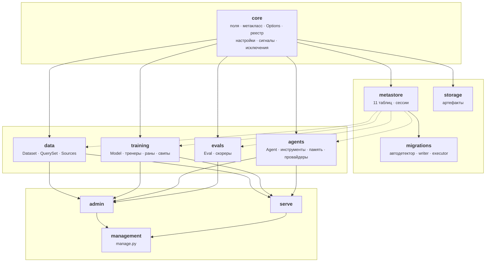
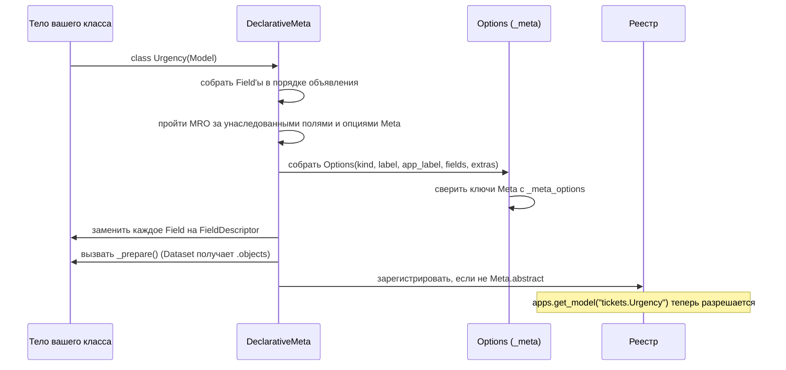
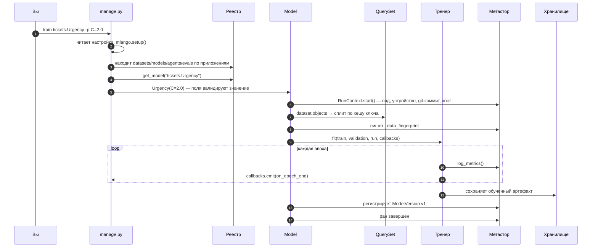
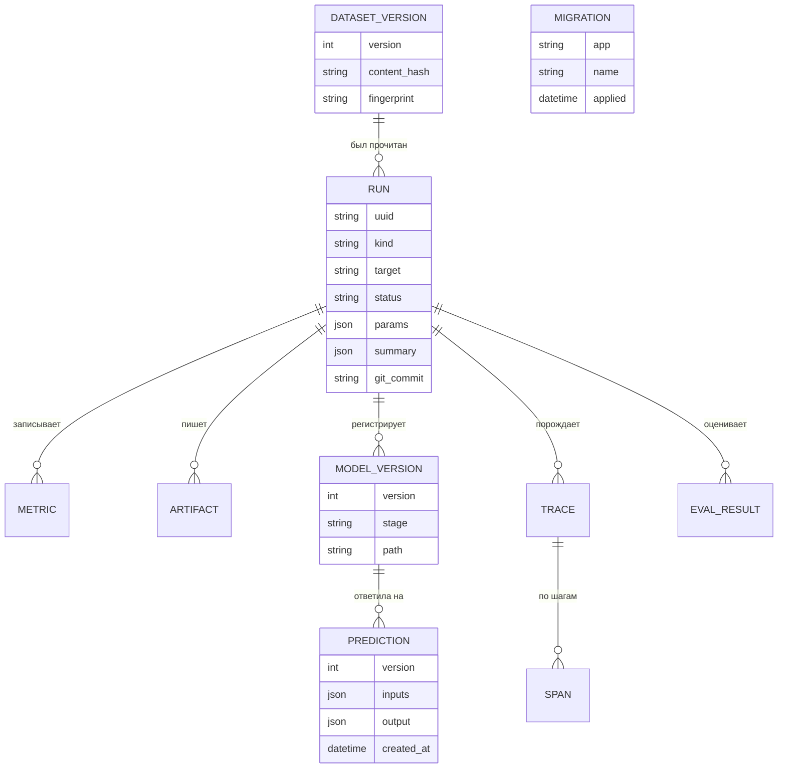
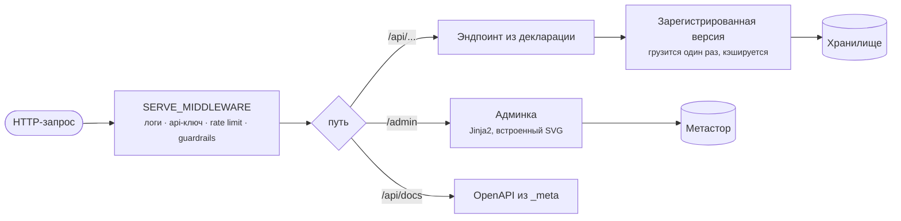

# Архитектура

Как устроены части, что что имеет право импортировать и что на самом деле
происходит при запуске команды. Каждая диаграмма здесь — текст в репозитории,
поэтому её видно в диффе.

## Слои

Правила, которые проверяют и `tests/`, и ревью:

| Слой | Может импортировать | Не должен импортировать |
|---|---|---|
| `core` | стандартную библиотеку | что-либо ещё из mlango |
| `metastore`, `storage` | `core` | четыре семейства |
| `data`, `training`, `agents`, `evals` | `core`, `metastore`, `storage` | **друг друга** |
| `admin`, `serve`, `management` | всё, но через `_meta` | — |

Важнее всего третье. Именно из-за того, что семейства не импортируют друг друга,
можно пользоваться агентской половиной без ML-половины, и поэтому проект,
объявляющий только датасеты, не загружает ни строчки агентского кода.

Помощник, который нужен двум семействам, живёт в `core`. `core/serialization.py`
существует ровно поэтому: `agents` и `evals` оба лезли в приватную функцию
внутри `training`.

## Как декларация становится метаданными

Два следствия, о которых стоит знать.

**Опции `Meta` наследуются.** Тела классов в Python сами по себе не наследуются,
поэтому подкласс, написавший свой `class Meta`, молча терял бы всё объявленное
родителем. `Options.inherit_extras()` дозаполняет то, чего подкласс не назвал, —
именно это делает возможным переиспользуемый базовый класс вроде
`TextClassifier`. `abstract` исключён, иначе каждый подкласс абстрактной базы был
бы абстрактным.

**Неизвестный ключ в `Meta` — ошибка.** С перечислением допустимых: молча
проигнорированная опция — это баг, который находят неделями позже.

## Что на самом деле делает `manage.py train`

Всё после пятого шага происходит независимо от того, просили вы об этом или нет.
В этом и состоит инверсия: то, что легко забыть, — это то, чего вы не пишете.

## Метастор

Одиннадцать таблиц, по умолчанию SQLite, та же схема на Postgres.

`RUN.kind` — это `train`, `sweep`, `eval` или `agent`. Поэтому свип и его
попытки, или вызов агента и обучение модели, живут в одной истории и одной
админке.

У версии датасета намеренно разделены две идентичности: `fingerprint` — хеш
*декларации*, `content_hash` — хеш *строк*. Изменение схемы и изменение данных —
разные события, и различить их через полгода и есть смысл хранить оба.

## Точки расширения

Каждая — это запись в настройках с путём к классу, поэтому замена любой из них
никогда не означает форк фреймворка.

| Точка | Настройка | Контракт |
|---|---|---|
| Тренер | `TRAINERS` | `fit`, `predict`, `save`, `load` |
| LLM-провайдер | `PROVIDERS` | один метод: `complete()` |
| Хранилище артефактов | `STORAGE["BACKEND"]` | `path`, `open`, `save_bytes`, `read_bytes`, `exists`, `delete`, `size`, `listdir` |
| Middleware сервинга | `SERVE_MIDDLEWARE` | ASGI middleware, снаружи внутрь |
| Колбэки обучения | `DEFAULT_CALLBACKS` | любое подмножество хуков `Callback` |
| Источник данных | `Meta.source` | итерируемое из словарей, по желанию `count()` |
| Команды | `<app>/management/commands/` | `Command(BaseCommand)`, можно переопределить встроенную |

Узкие контракты узки намеренно. У провайдера один метод, потому что цикл агента,
диспетчеризация инструментов, память и трейсинг принадлежат фреймворку: смена
провайдера не должна уметь менять поведение агента.

## Пути запроса

Админка и API — одно ASGI-приложение, поэтому `manage.py runserver` в разработке
это один процесс, а в продакшене тот же объект за gunicorn.
